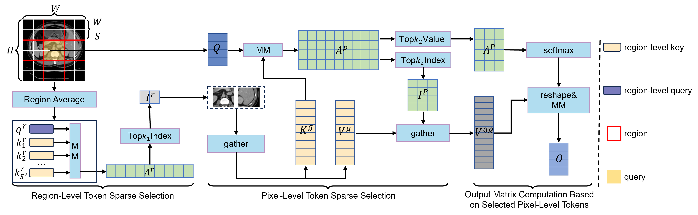
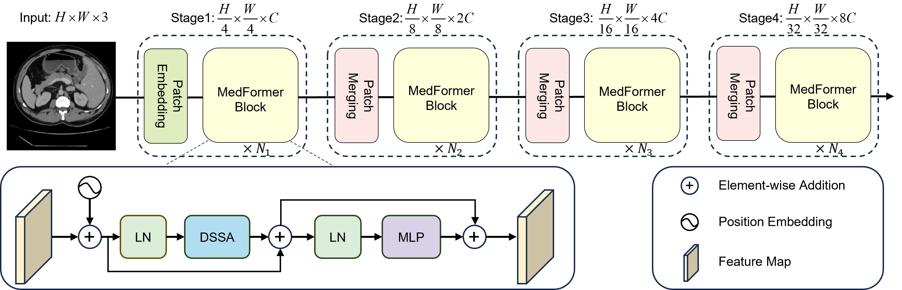

# MedFormer: Hierarchical Medical Vision Transformer with Content-Aware Dual Sparse Selection Attention
Zunhui Xia, Hongxing Li, Libin Lan

## Dual Sparse Selection Attention:

## MedFormer Architecture:

